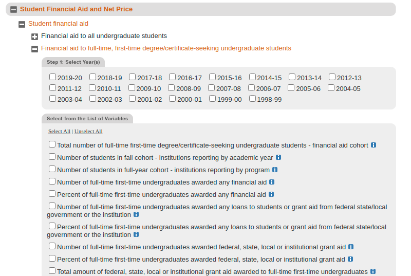
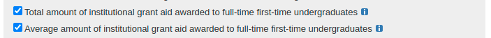

# Estimating Discount Rate

The IPEDS Student Financial Aid (SFA) survey can be used the estimate discount rates for Colleges and Universities. Discount rates in higher education are used to determine how much Colleges collect relative to the tuition "sticker price". Tuition sticker prices are discounted by Colleges by awarding students with institutional grant aid. Grant aid is considered "free money" in that students do not have to pay it back like in the case of a loan. Note that discount rate does not account for other grant sources like State or Federal grants which can further reduce the amount students pay. Since College and Universities receive this money, they do not consider them part of the discount.

Combining institutional grant aid for undergraduates from the SFA survey with the published tuition "sticker price", we can estimate discount rate or net tuition revenue. This is not going to match NACUBO discount rate survey results since the NACUBO survey accounts for Tuition waivers or Tuition benefits and the IPEDS SFA does not.

Here is the relevant SFA screen in the IPEDS data center: 

Scrolling down reveals options for downloading data on institutional grant aid:

