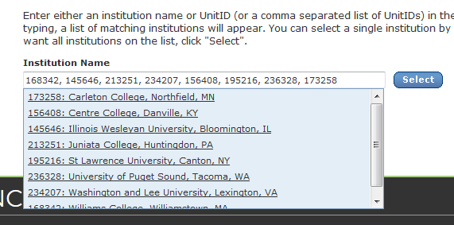

Working with IPEDS Data
=========

To facilitate pulling data on many schools at once, the [IPEDS data center](https://nces.ed.gov/ipeds/use-the-data
) uses .uid files which are simply pipe-delimited text files with no header row and 4 columns: IPEDS Unit ID, Institution Name, City, and State.

    168546|Albion College|Albion|MI           
    210669|Allegheny College|Meadville|PA           
    143084|Augustana College|Rock Island|IL         
    174747|College of Saint Benedict|Saint Joseph|MN

An alternative way of entering multiple school schools at once is to cut and paste a comma-separated list directly into the search box.


In R, with a data set of UnitIDs, you can `dput()` them to the console and paste them that way:
```r
require('tidyverse')

df <- read_csv('annapolis-group.csv')

dput(as.numeric(df$UnitID))

```


Once you paste these in, the search tool will deteact the schools and you can press *Select* and continue by choosing variables of interest.
